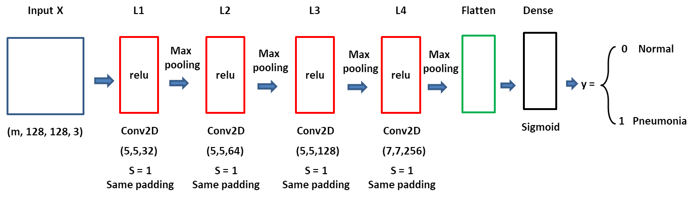

# Pneumonia_x_ray_classification
## Introduction  
This project's goal is to help doctor diagnose the pathological pneumonia from chest X ray pictures using a deep learning techniche.

So generally, a convolutional nerual network with 4 hidden layers to classify whether a x ray image is positive of pneumonia was trained by around 5 thousands of images mixed of both pneumonia negative and positive images. The model was created with Keras Framework.

## Data  
**Data Source:**  
https://www.kaggle.com/paultimothymooney/chest-xray-pneumonia

**Data List:**
1.  Training set: 5216 images  
2.  Dev set: 16 images  
3.  Testing set: 624 images  

**All the images are jpeg files. However, the formats of images are very varied. And some images in training set are in 'RGB' mode, while the others are in 'Greyscale' mode. Thus, all of these variations need to be consistent during the preprocessing step.**  

## Methodology  
**I.  Data preprocessing**  
1.  Load images with PIL in batch by glob.  
2.  Convert all the images to 'RGB' mode and resize them to 128 x 128 pixels (Using larger image would cause very complex computation, and the significance change is not worth of the computation cost).  
3.  Standardize the pixel value and convert the image data to numpy vectors, which are the X sets for the model inputs (including training, dev and testing). Create the related Y sets (vector of 0 for normal sets, 1 for pneumonia sets) based on the X set's shape.  
4.  Make the complete data sets by concatenating both normal and penumonia data sets for both X and Y.  
5.  Shuffle the data sets in random.  

**II. Building the model in Keras**  
The general idea is like model VGG-16 which keeps increasing filter units in the exponential of 2 and decreasing the image size by half with max pooling during every hidden layer. After 4 hidden layers of computation, the image data is converted from (128, 128, 3) to (5, 5, 256). The flatten vector is eventually computed by a sigmoid function to get the classification results (Fig.1).  

**_Fig.1_**   
**Hyperparameters (part of)**  
  * optimizer: Adam, learning rate: 0.001, beta_1: 0.9, beta_2: 0.999  
  * epochs: 20  
  * mini batch size: 16  

## Results  
By far, upon the current hyperparameters the best results are:  
  * Accurancy of training set: 1.0;  
  * Accurancy of dev set: 1.0;  
  * Accurancy of testing set: 0.83.  

The final result can be different by more iterations of training, hyperparameters tuning or other model architectures.    

## Discussion  

## Conclusion  

